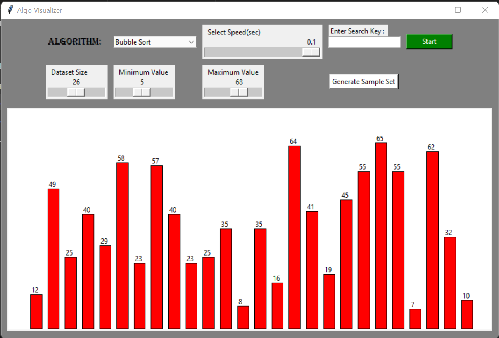
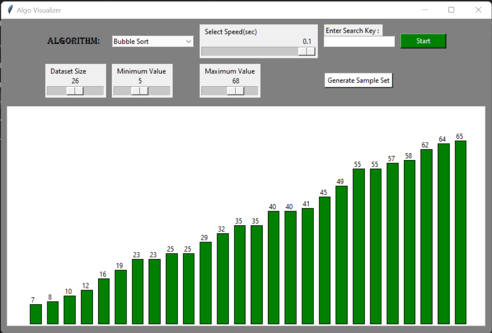

# Algo_Visualizer

This project is an Algorithm Visualizer where a user can visualize common algorithms like "Bubble Sort", "Merge Sort", "Quick Sort", "Selection Sort", "Linear Search" and "Binary Search". <br><br>

>Now let us see about the GUI

Here is a GUI where a user selects :
- Size of dataset
- Minimum value of the dataset
- Maximum value of the dataset
- Algorithm to perform from the drop down menu
- Select speed of the performance



- On press start button, the visualization is completed and the output looks like this...



> If you are using "Linear Search" or "Binary Search" enter the search key in the search key field and the press start.

>Modules used are :
 ```
 pip install tk
 ```
 ```
 pip install tk-tools
 ```
 
 > Hope you enjoy this project...🙃🙃🙃
